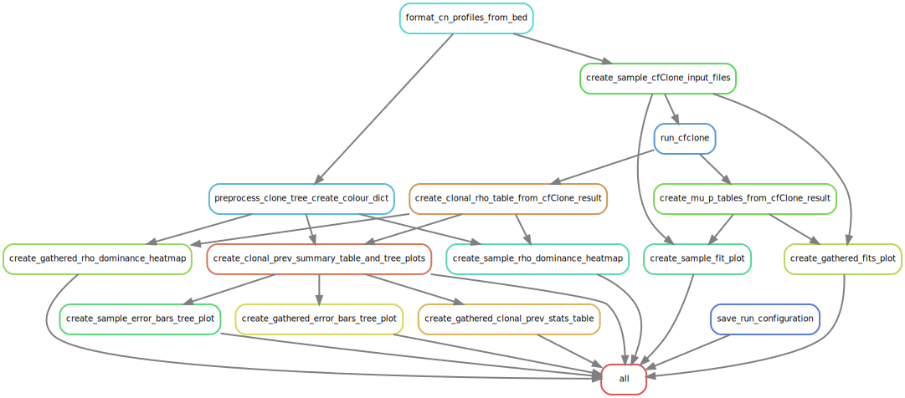

# cfClone-smk

A [Snakemake](https://snakemake.readthedocs.io/en/stable/) pipeline for running [cfClone](https://github.com/Roth-Lab/pt-cfclone).

--------

> [!IMPORTANT]  
> Pipeline requires snakemake v9.4 or greater

-------
# Dependencies
* [conda](https://github.com/conda-forge/miniforge), version >24.7.1
* [Snakemake](https://snakemake.readthedocs.io/en/stable/), version >=9.4
-------

# Setup

This pipeline requires that [conda](https://github.com/conda-forge/miniforge) and [Snakemake](https://snakemake.readthedocs.io/en/stable/) be installed; the [Bioconda](https://bioconda.github.io/#usage) package channel must also be configured.

## Environment Setup

1. Ensure that you have a working `conda` installation, you can do this by installing [Miniforge](https://github.com/conda-forge/miniforge#install).
2. Configure the [Bioconda channel](https://bioconda.github.io/#usage) and set strict channel priority:
   ```
   conda config --add channels bioconda
   conda config --add channels conda-forge
   conda config --set channel_priority strict
   ```
3. Install [Snakemake](https://snakemake.readthedocs.io/en/stable/):
   ```
   conda create -c conda-forge -c bioconda --name snakemake snakemake'>=9.4'
   ```

--------
# Usage

1. Adjust the [configuration file](config/example.yaml) to suit your dataset.
2. The following fields are required:
   - `out_dir`: path the output directory
   - `clonal_cn_bed`: path to the input (phased) clonal copy number profiles, in .bed format
   - `clone_tree_newick`: path to the clone phylogenetic tree, in newick (.nwk) format
   - `sample_tsv`: Path to bulk sample paths .tsv file, **must** contain the following columns:
     - `sample_id`: populated with sample IDs
     - `path`: populated with fully resolved paths to the input bulk sample data files
3. For a full description of all available pipeline options, please refer to the [schema](schemas/config.schema.yaml)
4. The remaining configuration options have been named to mirror the options cfClone, to read more on the available options and their use cases:
   * [cfClone documentation](https://github.com/Roth-Lab/pt-cfclone)
--------

# Slurm Cluster Support

A slurm [workflow-profile](https://snakemake.readthedocs.io/en/latest/executing/cli.html#profiles) has been created: [here](profiles/slurm/config.v8+.yaml)

Adjust as needed.

To run this pipeline using the slurm workflow-profile:
1. Ensure that the required [snakemake plugins](#required-snakemake-plugins-for-slurm-cluster-support) are installed.
2. SSH onto the cluster
3. On the login node start a screen session:
   - `screen -S cfclone`
4. From the screen session, activate your snakemake conda environment:
   - `conda activate snakemake`
5. From the screen session, launch the pipeline using the slurm workflow-profile:
   - `snakemake --workflow-profile profiles/slurm --configfile <path/to/config-file>`

> [!TIP]  
> Might be a good idea to launch a dry-run of the pipeline to ensure the ruleset and output are as you expect: `snakemake --workflow-profile profiles/slurm -n -q rules`

## Required Snakemake Plugins for Slurm Cluster Support

Please ensure the following plugin is available in your snakemake conda environment:
- [Slurm Plugin](https://snakemake.github.io/snakemake-plugin-catalog/plugins/executor/slurm.html)

The plugin is available through the Bioconda package channel:
- [Slurm Plugin](https://bioconda.github.io/recipes/snakemake-executor-plugin-slurm/README.html#package-snakemake-executor-plugin-slurm)
- `conda install snakemake-executor-plugin-slurm`

---

# Workflow Rulegraph


